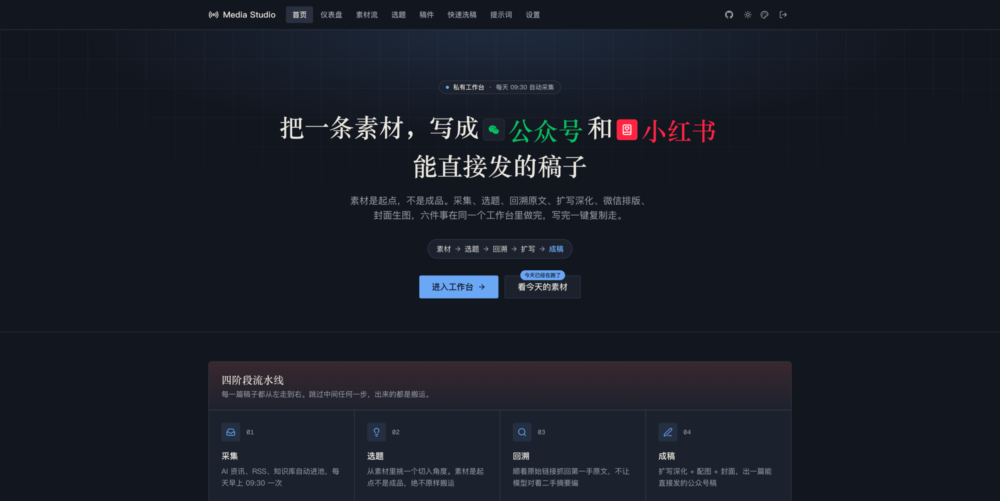
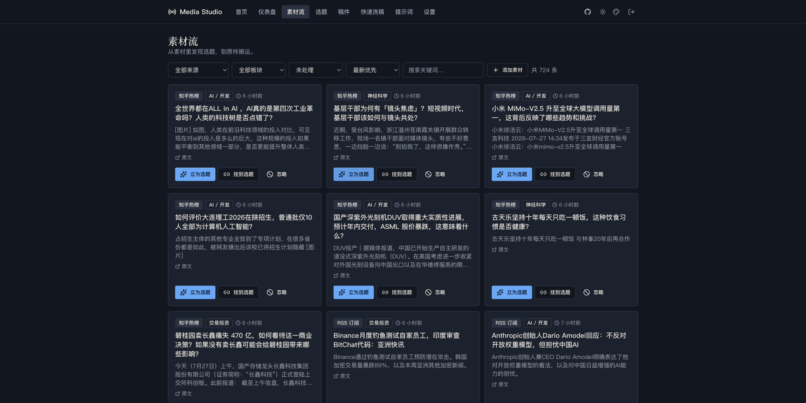
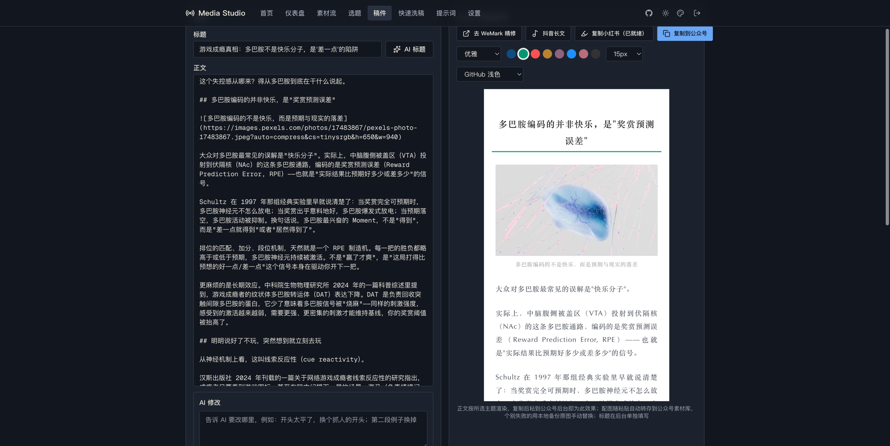

# Media Studio


自媒体「素材 → 稿件」一站式工作台。RSS 订阅采集选题素材，AI 把素材扩写成**公众号成稿（正文 + 自动配图 + AI 封面）**，再一键导出**小红书长文**和**抖音长文**。自部署、单用户、带全站密码门禁。

```
RSS 订阅源 ──┐
             ├─→ 素材收件箱 ─→ 立为选题 ─→ 回溯原文调研 ─→ 母稿 ─→ 公众号成稿
手动录入 ────┘                                                      │
                                                    ┌───────────────┼───────────────┐
                                                 排版预览        小红书长文        抖音长文
                                              （复制即贴）    （高亮+emoji）    （三段式导出）
```

|  |  |
| --- | --- |
|  |  |



## 在线体验

**https://media-studio-oss.vercel.app** — 访问密码 `mediastudio`

> 公共演示环境：未配置文案引擎 Key，AI 生成类功能不可用（自部署后在设置页填自己的 Key 即可）；演示数据公共可写，请勿存放重要内容。

## 功能

- **素材采集**：内置多组分类预置 RSS 源（AI 官方动态 / AI 科技媒体 / 开发者视角 / AI 工具发布 / 科学与认知 / 财经与加密），设置页一键添加；也可自定义添加任意 RSS 2.0 / Atom 源；每日 cron 自动采集，英文素材自动翻译标题摘要
- **选题工作流**：素材一键立为选题，AI 建议切入角度，自动回溯抓取原文提炼调研笔记
- **公众号成稿**：母稿两步制生成，反 AI 味写作规则 + 虚构红线内置；自动图库配图（Pexels/Pixabay）或 AI 现画知识图解；6 套风格的 AI 封面生成（支持模板参考图直生）
- **多平台导出**：公众号排版预览复制即贴（内联样式富文本）；小红书长文（AI 挑高亮句 + 段落 emoji）；抖音长文（标题/摘要/正文三段式）
- **洗稿模式**：粘贴任意中英文原文，自动抓取文内链接补充上下文，一键出稿
- **提示词中心**：全部系统提示词可视化编辑，改文风不用改代码
- **多引擎**：DeepSeek / 通义千问 / Kimi / OpenAI 兼容中转站，设置页在线切换；正文、轻量任务、翻译三套引擎独立可配

## 安装

### 方式一：让 AI 编程代理帮你装（推荐）

把下面整段提示词复制给 **Claude Code / Codex / Cursor** 等编程 Agent，它会替你完成全部安装：

````text
请帮我部署开源项目 media-studio（仓库 https://github.com/LeoLee0812/media-studio-oss）。
这是一个 Next.js 16 全栈应用，数据库用 Supabase Postgres（专用角色直连，不用 service key）。
按顺序做：

1. git clone https://github.com/LeoLee0812/media-studio-oss.git 并进入目录，npm install。

2. 数据库初始化（需要一个 Supabase 项目，没有就提示我去 https://supabase.com 免费创建一个）：
   a. 先执行建角色语句（密码用 openssl rand -hex 16 生成）：
      create role ms_app login password '<生成的密码>';
      grant usage on schema public to ms_app;
      grant ms_app to postgres;
   b. 再执行仓库里 supabase/migrations/0001_ms_init.sql 的全文。
   如果你能直接访问我的 Supabase（MCP 或 CLI），就替我执行；
   否则把上面两段 SQL 整理好，告诉我粘到 Supabase 后台 SQL Editor 里跑。

3. 生成 .env.local（参照仓库 .env.example 的中文注释）：
   - DATABASE_URL：transaction pooler 连接串，格式
     postgresql://ms_app.<项目ref>:<第2步的密码>@aws-0-<区域>.pooler.supabase.com:6543/postgres
     （项目 ref 和区域在 Supabase 后台 Settings → Database 能看到）
   - ACCESS_PASSWORD：给我设一个好记的站点访问密码，最后告诉我
   - AUTH_SECRET：openssl rand -hex 32
   - CRON_SECRET：openssl rand -hex 24
   - 文案引擎 Key（DEEPSEEK_API_KEY 等）我稍后自己在网站设置页填，先跳过。

4. npm run dev 启动，替我验证：用 ACCESS_PASSWORD 登录 http://localhost:3000，
   到设置页「RSS 订阅源」展开预置源库，整组添加「AI 科技媒体」，保存后点「手动拉取」，
   确认素材流页面出现素材。

5. 如果我要上线：推到我自己的 GitHub 仓库 → Vercel 导入 → 环境变量照 .env.local 配齐
   （CRON_SECRET 一定要配，vercel.json 里的每日采集 cron 靠它鉴权）→ 部署完把地址给我。

注意：所有生成的密钥只写进 .env.local（已被 .gitignore 忽略），不要出现在任何会提交的文件里；
每一步出问题就停下来告诉我卡在哪，不要带着错误继续。
````

### 方式二：手动安装

<details>
<summary>展开手动安装步骤（4 步）</summary>

**1. 建库（Supabase）**：新建 [Supabase](https://supabase.com) 项目，SQL Editor 里先建角色再跑迁移：

```sql
create role ms_app login password '<你的DB密码>';
grant usage on schema public to ms_app;
grant ms_app to postgres;
```

然后执行 `supabase/migrations/0001_ms_init.sql` 全文（4 张表 + RLS，anon key 默认全拒）。

**2. 配置环境变量**：`cp .env.example .env.local`，必填：

| 变量 | 说明 |
| --- | --- |
| `DATABASE_URL` | `postgresql://ms_app.<projectRef>:<密码>@aws-0-<区域>.pooler.supabase.com:6543/postgres` |
| `ACCESS_PASSWORD` | 全站访问密码 |
| `AUTH_SECRET` | `openssl rand -hex 32` |
| `DEEPSEEK_API_KEY` 等 | 文案引擎任选一家，也可部署后在设置页填 |

**3. 本地跑起来**：`npm install && npm run dev`，登录后到设置页添加 RSS 订阅源（预置源库一键添加）并「手动拉取」。

**4. 部署（Vercel）**：推到 GitHub 后在 Vercel 导入。`vercel.json` 已带每日采集 cron（UTC 01:00）；环境变量补上 `.env.local` 的内容和 `CRON_SECRET`，可选 `SITE_URL`（摘要邮件回链）与 `RESEND_API_KEY`（每日摘要邮件）。

</details>

## 技术要点

- **Next.js 16 App Router 全栈**，无独立后端；前端不直连数据库，读写全走 server route
- **安全模型**：4 张表 RLS 全开、仅 `ms_app` 角色有策略；服务端经 transaction pooler 直连；全站 HMAC 签名 cookie 门禁；采集/生成侧 URL 均过 SSRF 校验
- **serverless 连接自愈**：针对 pooler 挂死场景的三层防御（超时→重建连接池→重试），见 `lib/db.ts` / `lib/queries.ts`
- **提示词单一事实源**：全部写作规则在 `prompts/` 目录 md 文件，运行时可被数据库覆盖值热替换
- **结构化输出降级**：部分模型 `generateObject` 概率性退化（实测记录在 `docs/architecture.md`），注册表按模型自动降级并在 UI 明示

## 目录结构

```
app/          页面 + API 路由
lib/          核心逻辑（采集/生成/封面/配图/排版渲染/连接自愈）
components/   业务组件 + 设置页域卡片
prompts/      写作规则与系统提示词（单一事实源）
supabase/     建表 SQL
docs/         子系统文档
```

## License

[MIT](LICENSE)
